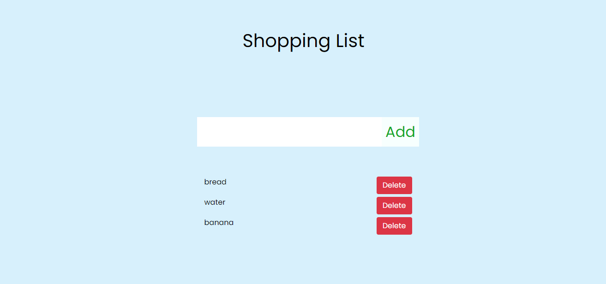

# Shopping List app

This app has been made to allow myself and my family members to access a unified shopping list. Any member can add items and delete them once they are bought.

## Contents

Backend project: This consists of a server that connects to a MongoDB database and post them to an API
Frontend project: This is a React app that fetches the API, displays the items and then allows the user to add or delete items.

## Notes for upgrades

This app will be upgraded in the future to allow for more functionalities.

## Inspiration

This app was constructed in react but deployement has been inspired by the following blog post: https://www.freecodecamp.org/news/how-to-create-a-react-app-with-a-node-backend-the-complete-guide/
